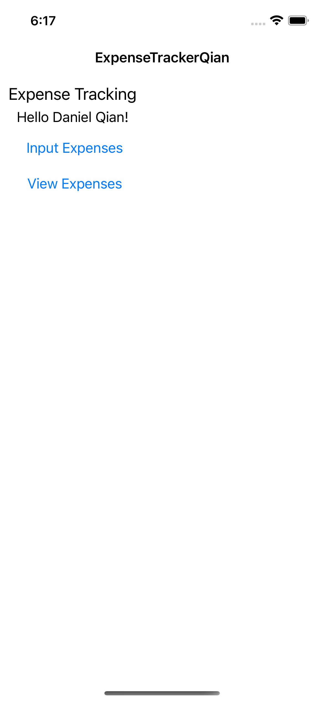
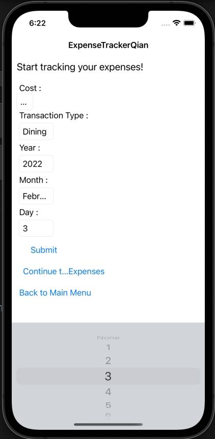
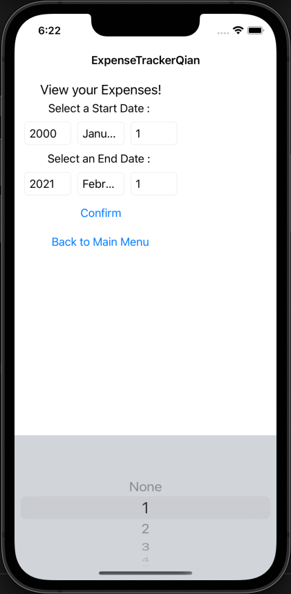
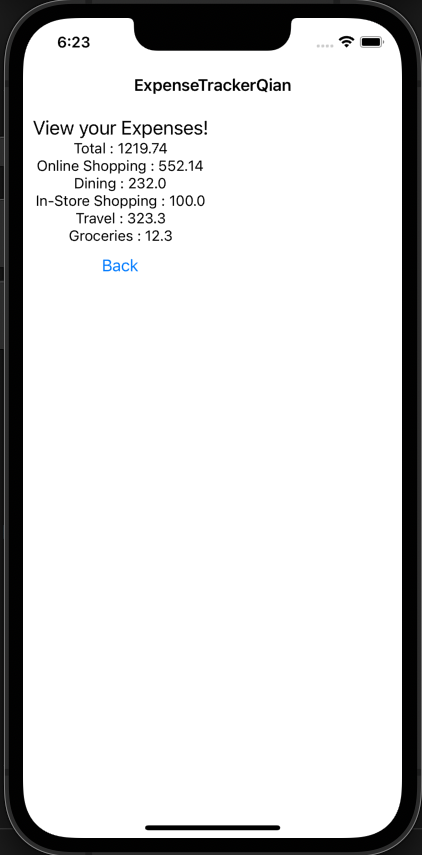

ExpenseTrackerQian
==================

Author : Daniel Qian [`LinkedIn <https://www.linkedin.com/in/danielqian5>`__] [`GitHub <https://github.com/DAQIANN>`__] [danielqian2015@gmail.com]

**This cross-platform app was generated by** `Briefcase`_ **- part of**
`The BeeWare Project`_. **If you want to see more tools like Briefcase, please
consider** `becoming a financial member of BeeWare`_.

Allowing for tracking of expenses

Many standard finanicial institutions have applications to help track the charges that a person puts on their account. Unfortunately, I have found them to be rather stiff in what they allow to be tracked.
Most charges are self-classified and costs can only be viewed within certain periods of time they deem as the right ranges. Therefore, I decided to create a more self-controlled way of seeing and inputting charges to better manage one's expenses.

Screenshots of Proof-of-concept:

Areas of Interest for Future:

- Adjusting the visuals of app
- Allocating cloud servicing to app

.. _`Briefcase`: https://briefcase.readthedocs.io/
.. _`The BeeWare Project`: https://beeware.org/
.. _`becoming a financial member of BeeWare`: https://beeware.org/contributing/membership
